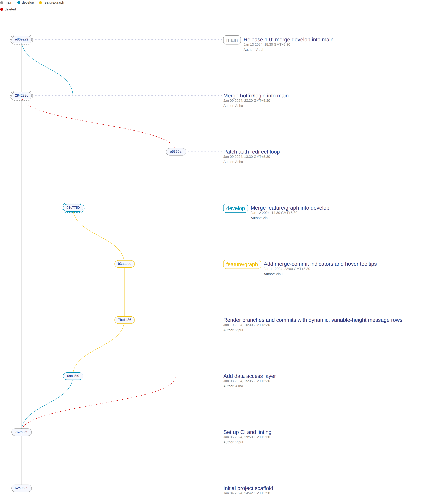

# commit-tree

Render git history - branches, commits, merges - as an SVG graph in the browser.



Built on [gitgraph.js](https://github.com/nicoespeon/gitgraph.js) (archived), extended with the things a real history view needs. Runs in production as CellRepo's commit graph.

## What it adds

- **Merge indicators** - merge commits get a dashed ring.
- **Deleted branches** - kept in the graph, drawn red and dashed.
- **Metadata** - author + date under each commit, and in a hover tooltip.
- **Dynamic sizing** - variable-height rows, auto-fit SVG, optional responsive mode.

Plus: branch legend, two node styles (`hash` / `label`), leader lines, hover linking.

## Quick start

```ts
import { createGitgraph } from "commit-tree";
import "commit-tree/src/commit-tree.css";

const gitgraph = createGitgraph(document.getElementById("graph")!, { nodeStyle: "hash" });

const main = gitgraph.branch("main");
main.commit({ subject: "Initial scaffold", author: "vipul", date: "2024-01-04T09:12:00Z" });

const feature = main.branch("feature/graph");
feature.commit({ subject: "Render commits", author: "vipul", date: "2024-01-10T11:00:00Z" });

main.merge(feature, "Merge feature/graph"); // -> merge indicator

const hotfix = main.branch("hotfix/login");
hotfix.commit({ subject: "Patch redirect", author: "asha" });
main.merge(hotfix);
hotfix.delete();                            // -> deleted-branch marker
```

## Options

| Option       | Type                | Default  | Description                          |
| ------------ | ------------------- | -------- | ------------------------------------ |
| `nodeStyle`  | `"hash" \| "label"` | `"hash"` | Hash pill + title, or title in-node. |
| `legend`     | `boolean`           | `true`   | Branch-color legend above the graph. |
| `responsive` | `boolean`           | `false`  | Fit the graph to its container.      |

Commits also take a `date` (ISO string), shown in the metadata and tooltip.

## Develop

```sh
npm install && npm run build   # build the library (src -> lib)

cd dev-frontend && npm install && npm run dev   # run the demo
```

The demo imports `src/` directly and exercises every feature.

## Credits

Built on [gitgraph.js](https://github.com/nicoespeon/gitgraph.js) by Nicolas Carlo and Fabien Bernard (MIT). The rendering layer, the features above, and the packaging are original. MIT licensed.
